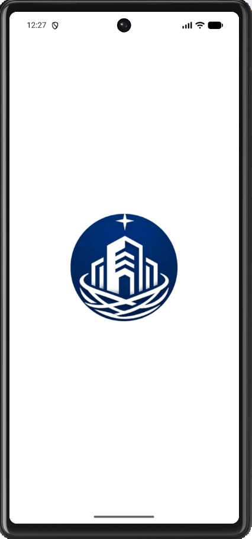
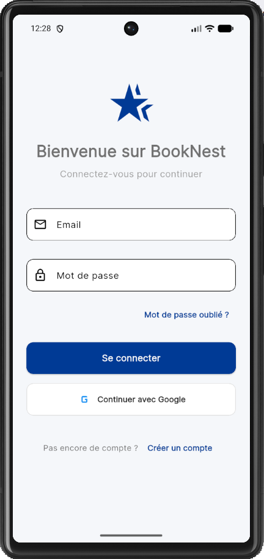
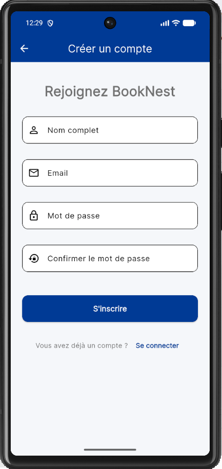
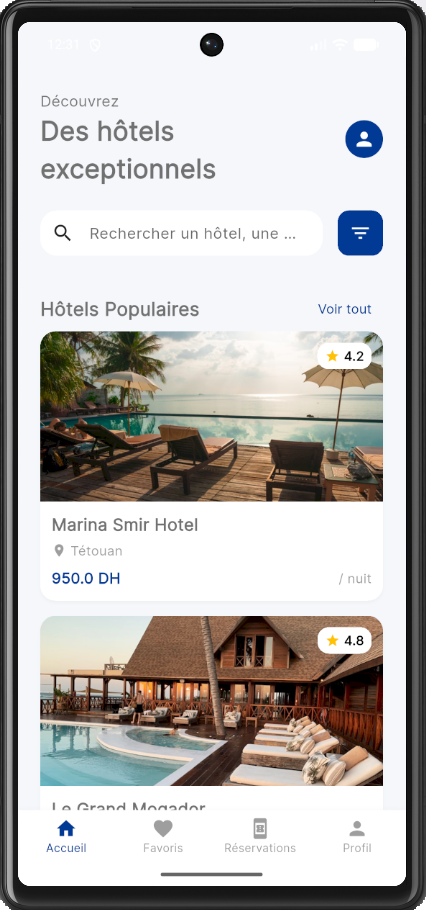
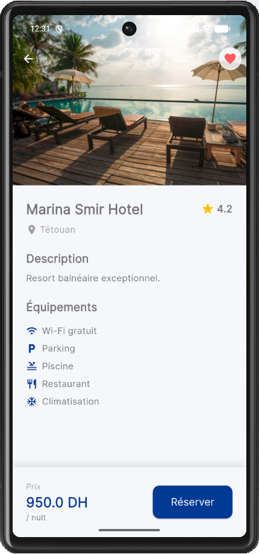
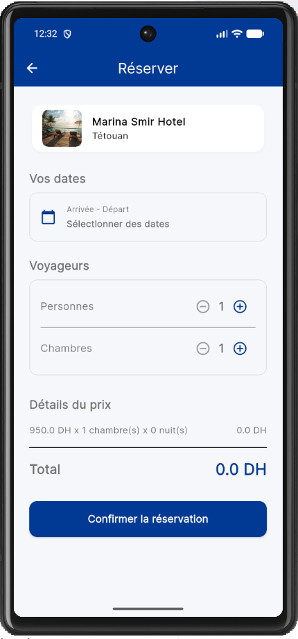
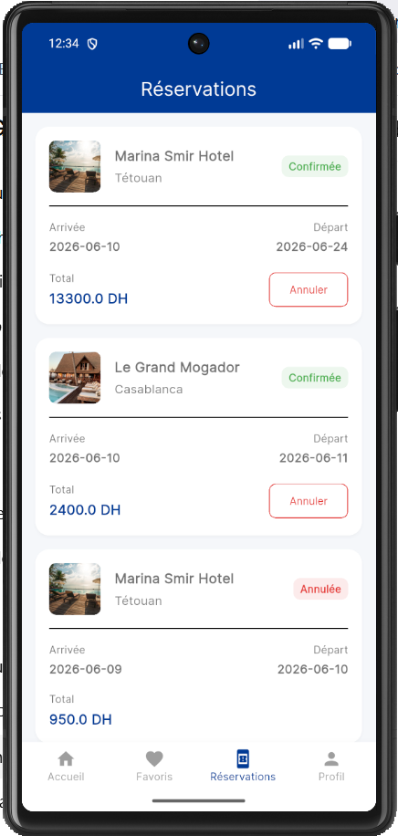
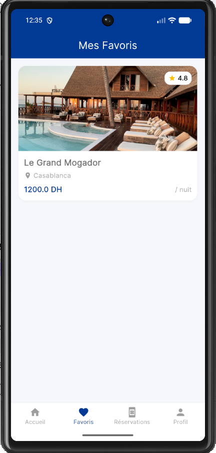
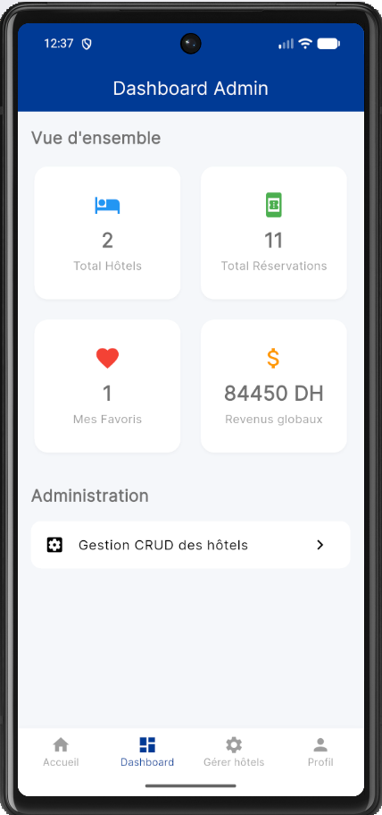
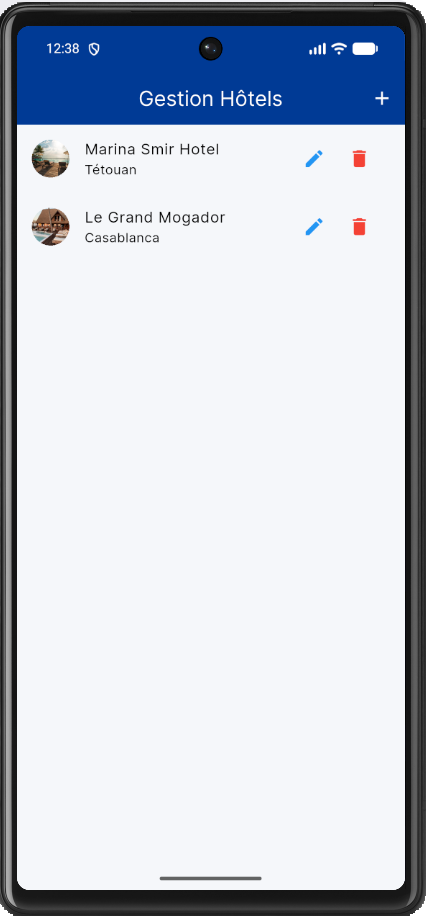

# BookNest — Application mobile de réservation d'hôtels

## 1. Présentation du projet

BookNest est une application mobile développée avec Flutter permettant aux utilisateurs de consulter des hôtels, voir les détails, ajouter des hôtels aux favoris, effectuer des réservations, consulter l'historique des réservations et gérer leur profil. L'application propose aussi un espace administrateur pour gérer les hôtels et suivre les réservations. 

Ce projet a été réalisé dans le cadre du mini-projet Flutter de 2ème année cycle ingénieur informatique. Il s'inspire de plateformes leaders comme Booking.com et Airbnb pour offrir une expérience utilisateur moderne et fluide.

## 2. Objectifs du projet

- **Mettre en pratique Flutter et Dart** dans un cas d'usage réel.
- **Développer une application mobile complète** de bout en bout.
- **Appliquer l'architecture MVC** pour séparer proprement la logique, les vues et les données.
- **Gérer l'authentification** de manière sécurisée.
- **Manipuler des données distantes** avec Firebase (Cloud Firestore).
- **Construire une interface moderne et responsive** inspirée des standards du marché.
- **Respecter les bonnes pratiques** de développement mobile (validation des données, feedback visuel, gestion des erreurs).

## 3. Fonctionnalités principales

### Utilisateur (Client)
- Inscription
- Connexion email/password
- Connexion avec Google
- Mot de passe oublié avec lien de réinitialisation Firebase
- Consultation des hôtels disponibles
- Détails complets d'un hôtel
- Ajout/retrait des hôtels aux favoris
- Réservation d'un hôtel (choix des dates et des voyageurs)
- Historique des réservations
- Annulation d'une réservation confirmée
- Gestion du profil utilisateur

### Administrateur
- Connexion sécurisée
- Tableau de bord avec statistiques
- Ajout d'un nouvel hôtel
- Modification des détails d'un hôtel existant
- Suppression d'un hôtel
- Consultation des réservations effectuées par l'ensemble des clients

## 4. Fonctionnalités obligatoires respectées

| Exigence du sujet | Réalisation dans BookNest |
|-------------------|---------------------------|
| **Authentification Login/Register** | Mise en place via Firebase Authentication (Email/Password + Google). |
| **Navigation entre écrans** | Utilisation du système de routes et pages natif de Flutter. |
| **CRUD** | Gestion complète des hôtels et réservations par l'administrateur. |
| **Formulaires** | Écrans de login, register, réservation, ajout/modification hôtel. |
| **Validation des champs** | Tous les formulaires disposent d'une validation stricte (`validators.dart`). |
| **Stockage local / persistance** | Firebase/Firestore pour les données partagées, `shared_preferences` pour la session. |
| **Interface moderne et responsive** | Design personnalisé (BookNest), adapté à toutes les tailles d'écran. |
| **Architecture MVC** | Séparation claire en `models`, `views`, et `controllers`. |
| **Icônes, thème et design** | Logo personnalisé, splash screen natif, palette de couleurs BookNest. |

## 5. Architecture MVC adoptée

BookNest repose sur une architecture Modèle-Vue-Contrôleur (MVC) permettant de découpler l'interface utilisateur de la logique métier et de la structure des données.

- **`models/`** : Classes représentant la structure des données métier (ex: `UserModel`, `HotelModel`, `BookingModel`, `FavoriteModel`).
- **`views/`** : Composants graphiques et écrans avec lesquels l'utilisateur interagit (ex: `LoginScreen`, `HomeScreen`, `HotelDetailScreen`).
- **`controllers/`** : Logique métier de l'application, gestion des requêtes Firebase et du flux de données (ex: `AuthController`, `HotelController`).
- **`widgets/`** : Composants visuels réutilisables à travers toute l'application (ex: `HotelCard`, `BookingCard`, `CustomButton`).

### Arborescence du projet

```text
lib/
│
├── controllers/
│   ├── auth_controller.dart
│   ├── booking_controller.dart
│   ├── favorite_controller.dart
│   └── hotel_controller.dart
│
├── models/
│   ├── booking_model.dart
│   ├── favorite_model.dart
│   ├── hotel_model.dart
│   └── user_model.dart
│
├── utils/
│   ├── app_colors.dart
│   ├── app_theme.dart
│   ├── constants.dart
│   └── validators.dart
│
├── views/
│   ├── admin_hotel_screen.dart
│   ├── booking_history_screen.dart
│   ├── booking_screen.dart
│   ├── dashboard_screen.dart
│   ├── favorites_screen.dart
│   ├── forgot_password_screen.dart
│   ├── home_screen.dart
│   ├── hotel_detail_screen.dart
│   ├── hotel_list_screen.dart
│   ├── login_screen.dart
│   ├── onboarding_screen.dart
│   ├── profile_screen.dart
│   ├── register_screen.dart
│   └── splash_screen.dart
│
├── widgets/
│   ├── booking_card.dart
│   ├── custom_button.dart
│   ├── custom_text_field.dart
│   ├── empty_state.dart
│   ├── hotel_card.dart
│   └── section_title.dart
│
└── main.dart
```

## 6. Technologies utilisées

- **Flutter** : Framework de développement d'applications mobiles multiplateformes.
- **Dart** : Langage de programmation orienté objet optimisé pour Flutter.
- **Firebase Authentication** : Gestion sécurisée des identités et des connexions (Email/MDP + Google Sign-In).
- **Cloud Firestore** : Base de données NoSQL en temps réel pour stocker les hôtels, réservations et favoris.
- **Material Design** : Système de conception standard pour une interface native et fluide.
- **flutter_launcher_icons** : Génération de l'icône de l'application (Logo BookNest).
- **flutter_native_splash** : Implémentation du splash screen natif avec support Android 12+.

## 7. Captures d'écran de l'application

| Écran          | Capture                                              |
| -------------- | ---------------------------------------------------- |
| Splash Screen  |              |
| Connexion      |                |
| Inscription    |          |
| Accueil        |                  |
| Détail hôtel   |  |
| Réservation    |            |
| Historique     |   |
| Favoris        |        |
| Administration |      |
| Gestion hôtels |  |

## 8. Installation et exécution du projet

### Prérequis
- Flutter SDK installé
- Dart installé
- Android Studio ou VS Code
- Un émulateur Android ou un téléphone Android configuré pour le débogage USB
- Un compte Firebase configuré

### Étapes d'installation

1. Clonez le dépôt et accédez au dossier du projet :
```bash
git clone <LIEN_DU_DEPOT_GITHUB>
cd demo
```

2. Installez les dépendances :
```bash
flutter pub get
```

3. Lancez l'analyse du code (optionnel mais recommandé) :
```bash
flutter analyze
```

4. Lancez l'application sur votre émulateur ou appareil physique :
```bash
flutter run
```

5. Pour générer l'APK de production (Release) :
```bash
flutter build apk --release
```
*L'APK généré se trouvera dans `build/app/outputs/flutter-apk/app-release.apk`.*

## 9. Configuration Firebase

Pour faire fonctionner ce projet avec votre propre base de données, vous devez configurer Firebase :

1. Créez un projet Firebase dans la [Firebase Console](https://console.firebase.google.com/).
2. Ajoutez une application Android en veillant à ce que le nom du package corresponde exactement à : `com.example.demo`.
3. Activez **Firebase Authentication** et configurez :
   - Fournisseur "E-mail/Mot de passe"
   - Fournisseur "Google"
4. Activez **Cloud Firestore** et créez la base de données.
5. Téléchargez le fichier de configuration `google-services.json` depuis Firebase.
6. Placez ce fichier dans le répertoire de votre projet Flutter : `android/app/google-services.json`.

## 10. Rôles utilisateurs

Le système attribue par défaut le rôle `client` aux nouveaux inscrits, sauf pour l'administrateur système.

- **Client** : Peut consulter la liste des hôtels, ajouter des hôtels aux favoris, effectuer et gérer ses réservations.
- **Administrateur** : A accès à un tableau de bord (Dashboard) spécifique. Il peut ajouter, modifier, ou supprimer des hôtels, et a une vue globale sur les réservations des clients.

Un compte administrateur est créé directement dans Firebase Authentication (par exemple via l'email `admin@booknest.com`).

## 11. Bonnes pratiques appliquées

- **Séparation MVC stricte** : Pour un code évolutif et maintenable.
- **Code organisé par responsabilité** : Les contrôleurs s'occupent uniquement de la logique métier.
- **Validation des formulaires** : Un fichier utilitaire `validators.dart` unifie les contrôles.
- **Gestion des erreurs Firebase** : Interception précise (`try-catch`) pour offrir un retour utilisateur clair (ex: "Mot de passe incorrect" au lieu d'une simple erreur système).
- **Utilisation de composants réutilisables** : Boutons, champs de texte et cartes centralisés dans le dossier `widgets/`.
- **Design responsive** : S'adapte gracieusement à la taille des appareils.
- **Identité visuelle** : Icône et splash screen personnalisés, avec le nom d'application modifié localement en `BookNest`.

## 12. Tests réalisés

L'ensemble des workflows de l'application a été rigoureusement testé :

- Création de compte (avec validations)
- Connexion (Email et Google Sign-in)
- Réinitialisation du mot de passe via l'email Firebase
- Ajout et retrait d'un hôtel aux favoris (avec mise à jour asynchrone)
- Création d'une réservation
- Annulation d'une réservation confirmée
- Ajout, modification et suppression d'hôtels en tant qu'administrateur
- Génération et installation réussies de l'APK en mode release

## 13. Captures et démonstration

Les captures principales de l'application sont disponibles dans le dossier `assets/screenshots/`.

## 14. Auteurs

Projet réalisé par :
- BEN ABDELLAH Mosab
- EL HADRI MOHAMED YASSINE

Encadré par :
- Prof. TBATOU Zakariae

## 15. Date limite

Date de remise : **10 Juin 2026**
